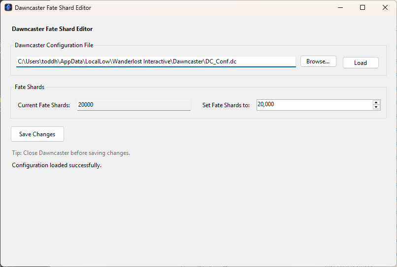

# Dawncaster Fate Shard Editor

**A simple Windows utility that makes it easy to change your Fate Shard
balance in Dawncaster without manually editing game files.**



[Download the latest
version](https://github.com/toddhd/Dawncaster-Fate-Shard-Editor/releases/latest)
\| [Direct download: v1.0.1
EXE](https://github.com/toddhd/Dawncaster-Fate-Shard-Editor/releases/download/v1.0.1/DawncasterFateShardEditor.exe)
\| [View all
releases](https://github.com/toddhd/Dawncaster-Fate-Shard-Editor/releases)

## What is this?

Dawncaster Fate Shard Editor is a small Windows application for players
of **Dawncaster** who want an easier way to edit the number of Fate
Shards stored in the Windows game's local configuration file.

Normally, changing this value requires finding:

`%USERPROFILE%\AppData\LocalLow\Wanderlost Interactive\Dawncaster\DC_Conf.dc`

and manually locating and editing the `m_CurrentFateShards` value inside
the file.

This utility does that work for you through a simple graphical
interface. It automatically looks for the standard Dawncaster
configuration file, reads your current Fate Shard balance, lets you
enter a new amount, creates a backup of the original file, and saves the
change.

No manual JSON editing is required.

## Features

- Automatically looks for the standard Windows Dawncaster
  configuration file
- Displays your current Fate Shard balance
- Lets you enter a new Fate Shard amount
- Validates the configuration file before changing it
- Changes only the `m_CurrentFateShards` value
- Creates a timestamped backup before saving
- Provides clear error messages if the file cannot be found, read, or
  saved
- Responsive Windows interface with DPI scaling
- Self-contained Windows executable with no separate .NET installation
  required

## Download

### Latest release

**[Download the latest
release](https://github.com/toddhd/Dawncaster-Fate-Shard-Editor/releases/latest)**

### Current version: v1.0.1

**[Download DawncasterFateShardEditor.exe
directly](https://github.com/toddhd/Dawncaster-Fate-Shard-Editor/releases/download/v1.0.1/DawncasterFateShardEditor.exe)**

You can also [view all releases and release
notes](https://github.com/toddhd/Dawncaster-Fate-Shard-Editor/releases).

The prebuilt release is intended for Windows 10 or Windows 11 and is
self-contained. You do not need to install the .NET runtime separately.

## How to use it

1.  **Close Dawncaster.** This is important because the game may
    overwrite its configuration while it is running.
2.  Download `DawncasterFateShardEditor.exe` from the latest GitHub
    release.
3.  Run `DawncasterFateShardEditor.exe`.
4.  The editor will automatically look for your Dawncaster configuration
    file in the normal Windows location.
5.  Check the **Current Fate Shards** value to confirm the correct file
    was loaded.
6.  Enter the amount you want in **Set Fate Shards to**.
7.  Click **Save Changes**.
8.  The editor will create a backup of your existing configuration and
    then save the new Fate Shard value.
9.  Start Dawncaster and confirm your new Fate Shard balance.

If Dawncaster is installed normally but the editor cannot locate the
configuration file, use **Browse...** to select `DC_Conf.dc` manually.

## Where is the Dawncaster configuration file?

For a standard Windows installation, Dawncaster stores this
configuration at:

`%USERPROFILE%\AppData\LocalLow\Wanderlost Interactive\Dawncaster\DC_Conf.dc`

For example:

`C:\Users\YourName\AppData\LocalLow\Wanderlost Interactive\Dawncaster\DC_Conf.dc`

The editor attempts to locate this file automatically.

## Using the editor with Android through Cloud Save

Dawncaster is also available on Android. This editor does **not** directly modify files on an Android phone or tablet, but Android players may still be able to benefit from it by using Dawncaster's built-in **Cloud Save** feature.

If your Dawncaster progress is shared between the Windows and Android versions, changes made with this editor on Windows may be transferred to Android when the game synchronizes your save data.

### Suggested steps

1. Make sure you are using the same Dawncaster cloud account/save on both Windows and Android.
2. Enable **Cloud Save** in Dawncaster on both devices.
3. Allow both versions of the game to synchronize normally before making any changes.
4. Close Dawncaster on Windows.
5. Run the Fate Shard Editor on Windows and change your Fate Shard balance.
6. Start Dawncaster on Windows and confirm that the new Fate Shard amount appears.
7. Allow the Windows version time to synchronize its updated save to the cloud.
8. Close Dawncaster on Windows.
9. Start Dawncaster on your Android device while connected to the internet and allow it to synchronize.
10. Check whether the updated Fate Shard balance has transferred to Android.

### Important Android / Cloud Save warning

Cloud synchronization can potentially overwrite newer save data with data from another device. Before experimenting with cross-device syncing, make sure your important game progress is safely synchronized and avoid playing on both devices at the same time.

The Fate Shard Editor creates a backup of the **Windows** `DC_Conf.dc` file before editing it, but that backup does not protect or restore Android save data or cloud data.

**Cloud transfer of an edited Fate Shard balance is not guaranteed.** Dawncaster or its cloud-save implementation may change, and not every value stored locally is necessarily synchronized between platforms. If Fate Shards do not transfer, the Windows editor has not modified your Android device.

At present, this utility does not directly edit Dawncaster files on Android.

## Backups and restoring your original file

**A backup is created before the editor saves a change.**

The backup is stored in the **same folder as `DC_Conf.dc`**:

`%USERPROFILE%\AppData\LocalLow\Wanderlost Interactive\Dawncaster\`

Backups use a timestamped filename similar to:

`DC_Conf.backup_20260820_153045.dc`

This means previous backups are not intentionally overwritten each time
you use the editor.

### How to restore a backup

1.  Close Dawncaster and the Fate Shard Editor.
2.  Open:
    `%USERPROFILE%\AppData\LocalLow\Wanderlost Interactive\Dawncaster\`
3.  Make a copy of the current `DC_Conf.dc` somewhere safe if you may
    want it later.
4.  Find the backup you want to restore, such as
    `DC_Conf.backup_20260820_153045.dc`.
5.  Rename the current `DC_Conf.dc` or move it out of the folder.
6.  Make a **copy** of the desired backup file.
7.  Rename that copied file to: `DC_Conf.dc`
8.  Start Dawncaster.

Using a copy allows you to keep the timestamped backup available in case
you need it again.

## Important warning

This utility **modifies a Dawncaster configuration file**.

Although the editor validates the file and creates a backup before
saving, modifying game data always carries some risk. A game update
could also change the configuration format or behavior in a way this
utility does not expect.

**Use this software at your own risk.**

Before editing, it is recommended that you:

- Close Dawncaster completely.
- Keep the automatically generated backup files.
- Avoid manually deleting backups until you are confident the game is
  working normally.
- Restore a backup if Dawncaster behaves unexpectedly after a change.

The author is not responsible for lost progress, corrupted configuration
files, or other problems resulting from use of this utility.

## Windows security notice

Because this is a small independently distributed application and is not
digitally code-signed, Windows or your browser may display a security or
SmartScreen warning when downloading or running it.

Only download releases from this GitHub repository. The complete source
code is available here for inspection.

## Building from source

The project is a C# WinForms application targeting .NET 8.

To run it from source:

```powershell
dotnet run
```

To publish a self-contained Windows x64 executable:

```powershell
dotnet publish -c Release -r win-x64 --self-contained true -p:PublishSingleFile=true
```

The published executable will be created under:

`bin\Release\net8.0-windows\win-x64\publish\DawncasterFateShardEditor.exe`

## Disclaimer

This is an unofficial, fan-made utility. It is not affiliated with,
endorsed by, or supported by Wanderlost Interactive or the developers of
Dawncaster.

Dawncaster and related names and trademarks belong to their respective
owners.
